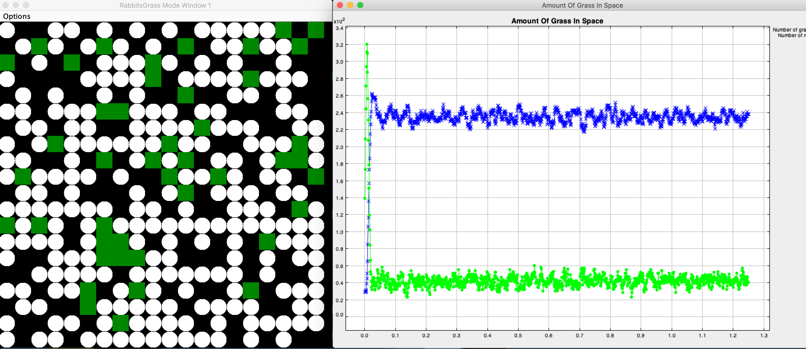

# Population simulation using RePast

The Rabbits Grass simulation is a simulation of an ecosystem: rabbits wander around randomly on a discrete grid environment on which grass is growing randomly. Rabbits have an initial amount of energy and with each move they lose a part of it. Once their energy is 0, they die. But when an alive rabbit bumps into some grass, it eats the grass and gains some energy. If a rabbit gains enough energy, it reproduces. The reproduction takes some energy so the rabbit can not reproduce twice within the same simulation step. The grass can be adjusted to grow at different rates and give the rabbits differing amounts of energy. It has to be possible to fully control the total amount of grass being grown at each simulation step. The model can be used to explore the competitive advantages of these variables.

##Todo :

- Report.
